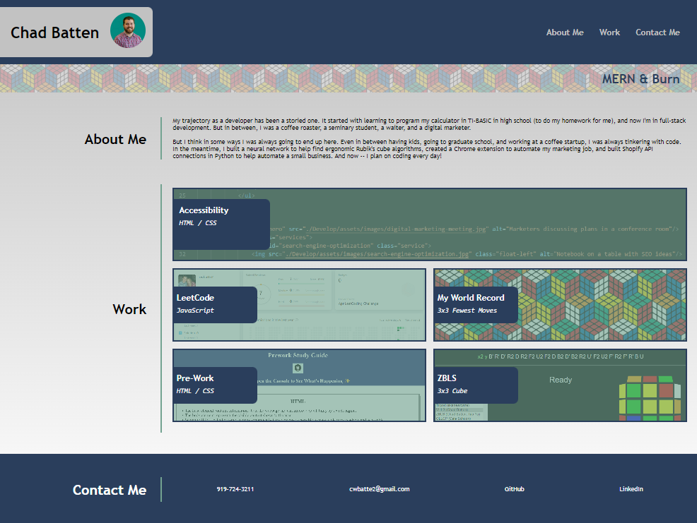

# Chad's Responsive Portfolio / Module 02

## Description

Created personal portfolio site that will be the future home for projects developed within (and outside of) this course. Site was made to be responsive to viewports of all sizes, and makes displays the most important application as the most prominent project. This page also contains brief personal descriptions and ways I can be found online.

## Usage

Visit https://obelisk477.github.io/week-02-homework/ and navigate the page as you see fit 

## Credits

* Idea and some code for pseudo elements (CSS line 148) came from https://coder-coder.com/background-image-opacity/#:~:text=To%20fix%20this%20issue%2C%20we,opacity%20without%20affecting%20each%20other!

* .hintrc file generated by ESLint extension

* MIT License generated by GitHub

## Screenshot

## License

Please refer to the LICENSE in the repo.
